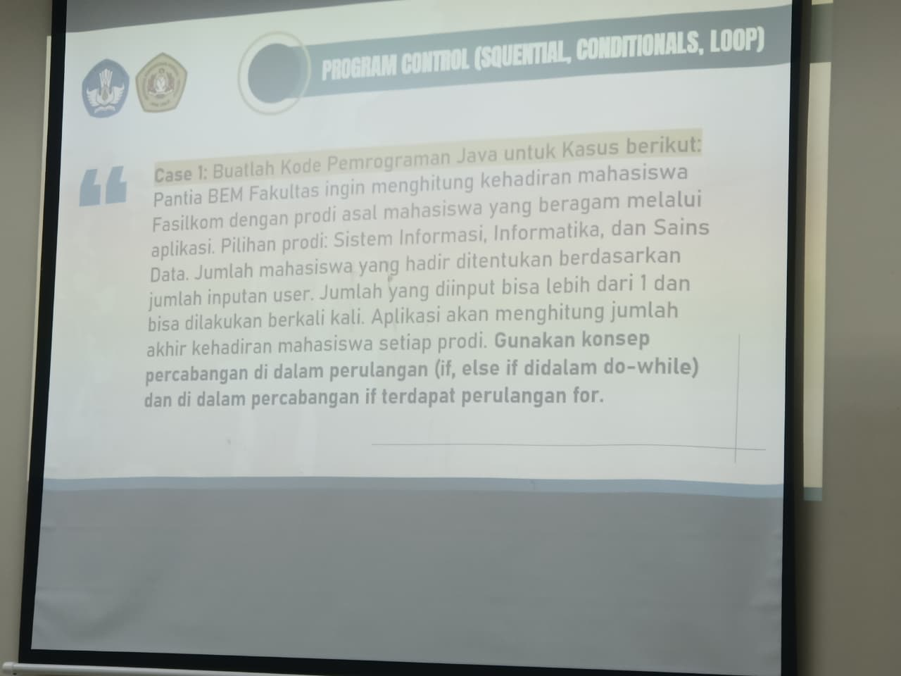

# STUDI CASE 1
## Aplikasi Pendataan Mahasigma Fasilkom
Deskripsi: Program menggunakan loop do-while, for, dan percabangan else if. User akan menginput pilihan Prodi (SI, INFOR, SADA). Setelah itu, user akan memilih jumlah Mahasigma yang ingin diinput, dan program akan melakukan pertambahan untuk tiap Mahasigma di tiap Prodi. Setelah itu akan ditampilkan jumlah Mahasigma tiap-tiap prodi. Setelah itu, user akan mempunyai pilihan untuk melakukan ulang dari awal atau tidak.

Foto Tugas:
