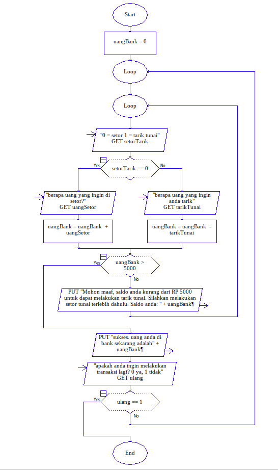
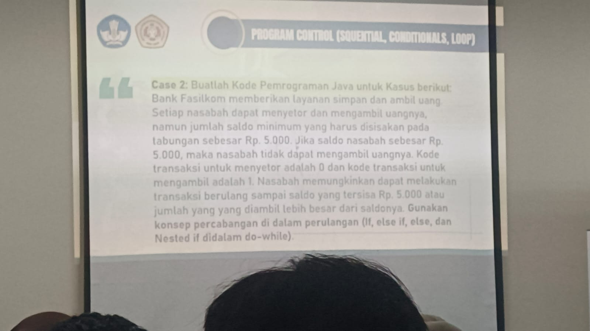

# STUDI KASUS 2
## ATM Setor Tarik Tunai
Deskripsi: Program ATM sederhana dengan fitur tarik dan setor tunai, dengan minimal saldo di ATM sebesar 5000, jika saldo ada dibawah 5000, maka tidak bisa melakukan tarik tunai. Menggunakan konsep percabangan (branching/if/else/else if) didalam perulanganan (loop) dan juga nested if.

Flowchart:

Foto Tugas:
