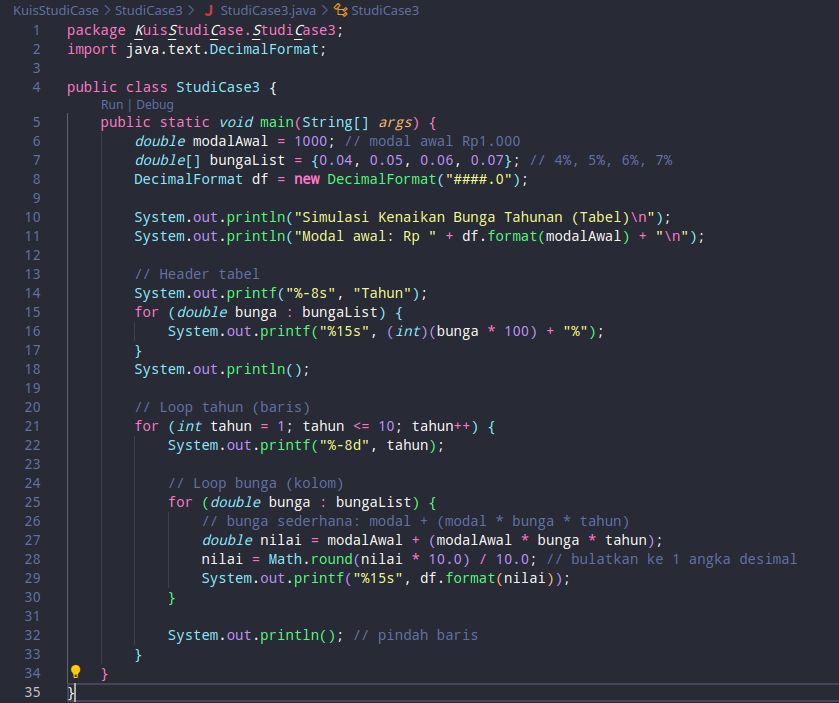
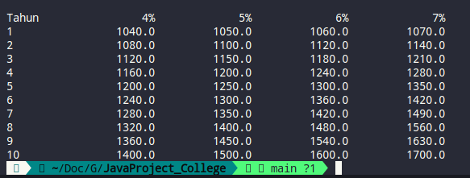

# STUDI KASUS 3 - ETS
## Program yang akan menampilkan bunga 4% - 7% selama 10 tahun

## Kode:


## Output

## Penjelasan Code
```
public class KuisStudiCase.StudiCase3 {
    public static void main(String[] args) {
```
Mendefinisikan kelas KuisStudiCase3 didalam folder KuisStudiCase dan fungsi utama `main()` sebagai titik awal program dijalankan.

```
        double modal = 1000;
```
Mendefinisikan variabel `modal` dengan nilai awal Rp 1000 sebagai modal awal tabungan.

```
        double[] bunga = {0.04, 0.05, 0.06, 0.07};
```
Membuat array bunga yang berisi 4 tingkat suku bunga: 4%, 5%, 6%, dan 7%.

```
        System.out.printf("Modal awal: Rp %,.1f%n%n", modal);
```
Menampilkan modal awal dengan format angka 1 digit di belakang koma dan menggunakan tanda koma sebagai pemisah ribuan.

```
        System.out.printf("%-10s", "Tahun");
```
Menampilkan kolom pertama dengan teks “Tahun” (rata kiri selebar 10 karakter).

```
        for (double b : bunga) {
            System.out.printf("%15s", (int)(b * 100) + "%");
        }
```
- Melakukan loop untuk menampilkan semua persentase bunga (4%, 5%, 6%, 7%) di bagian atas tabel.
    
- `%15s` berarti setiap kolom lebarnya 15 karakter agar hasil rapi berjajar.

```
        System.out.println();
```
Memberi baris baru setelah baris judul kolom selesai ditampilkan.

```
        for (int tahun = 1; tahun <= 10; tahun++) {
```
Membuat loop dari tahun 1 sampai 10, untuk menghitung saldo setiap tahunnya.

```
            System.out.printf("%-10d", tahun);
```
Menampilkan nomor tahun di kolom pertama tabel.

```
            for (double b : bunga) {
                double saldo = modal * Math.pow(1 + b, tahun);
                saldo = Math.round(saldo / 10.0) * 10.0;
                System.out.printf("%15,.1f", saldo);
            }
```
- Loop dalam untuk menghitung saldo berdasarkan tiap suku bunga.
    
- `Math.pow(1 + b, tahun)` menghitung bunga majemuk (berkembang tiap tahun).
    
- `Math.round(saldo / 10.0) * 10.0` digunakan untuk membulatkan hasil ke kelipatan 10, agar hasil seperti 1,080.0 bukan 1,081.6.
    
- `%15,.1f` menampilkan angka dengan format: lebar 15 karakter, 1 digit desimal, dan koma pemisah ribuan.

```
            System.out.println();
        }
    }
}
```
- `System.out.println();` memberi baris baru setelah setiap tahun selesai ditampilkan.
    
- Penutup untuk loop, fungsi, dan kelas.