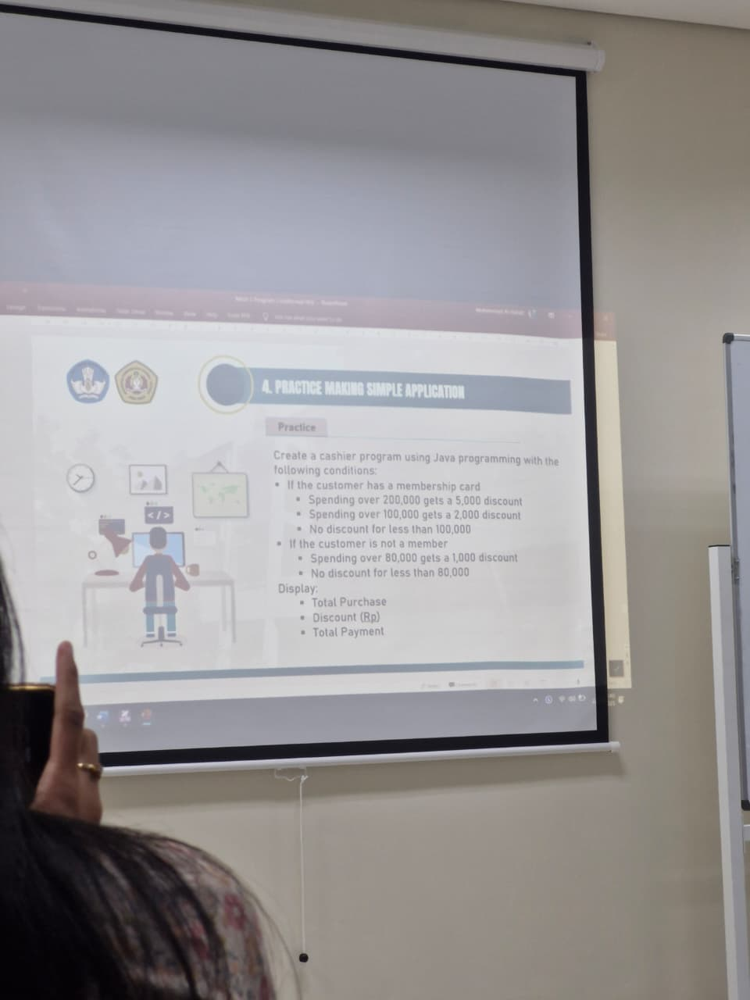

# APLIKASI DISKON
KALKULASI BERDASARKAN KEPEMILIKAN MEMBER DAN HARGA BARANG YANG DIBELI
Tugas BP 1 Pertemuan 5

## Deskripsi
user input harga barang yang dibeli, user input punya member/tidak, apakah barang lebih dari sekian? jika ya, apakah user punya member? jika ya, tampilkan harga diskon yang sesuai

## FLOWCHART
menyusul nanti

