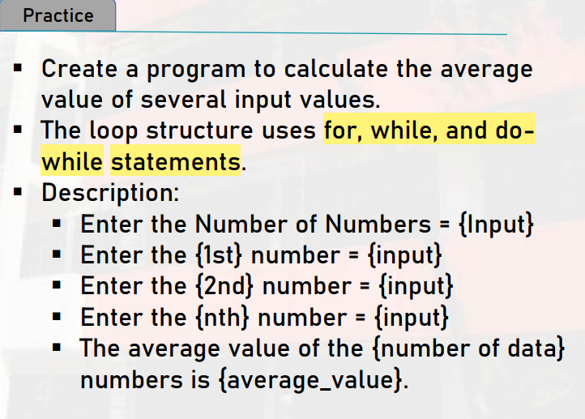
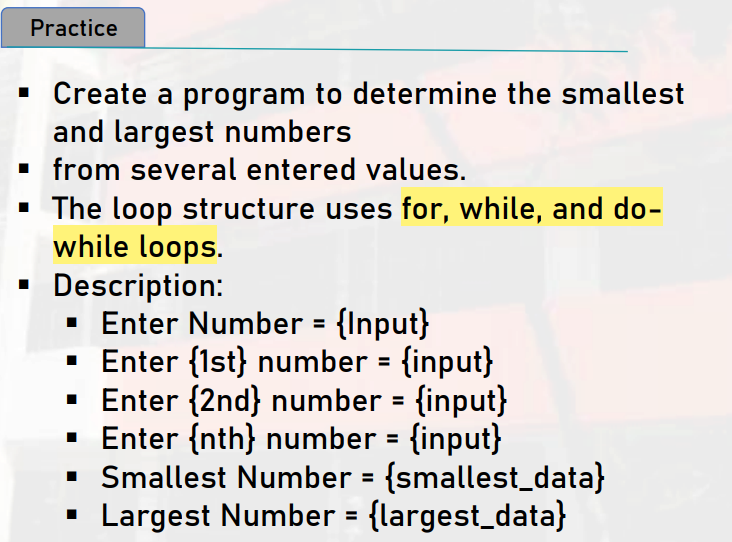
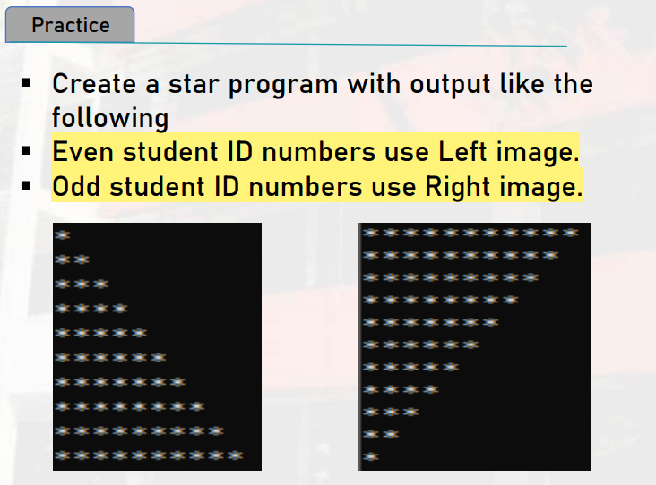

# LATIHAN DAN TUGAS TENTANG LOOPING
Berisi loop do, for, do-while, dan lain-lain

## TUGAS AVERAGE CALCULATION
BP PERTEMUAN 6
Kalkulasi rata-rata dari angka yang diinput oleh user, dan menggunakan loop for, while, do-while, jadi 3 kali input menggunakan tipe kalkulasi looping yang berbeda.

## TUGAS SMALLLARGENUMCALC
BP PERTEMUAN 6
Kalkuklasi nilai angka teresar dan terkecil dari angka yang sudah diinput oleh user, menggunakan loop for, while, do-while

## TUGAS BUAT BINTANG SEPERTI DI GAMBAR
BP PERTEMUAN 6
Membuat output gambar bintang seperti di gambar, menggunakan for loop.

